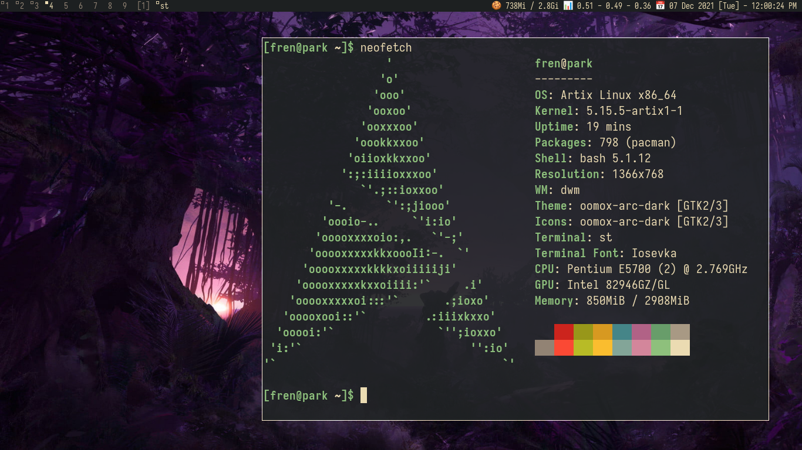

### current configuration

using seamonkey for surfing, irc, and email
custom nvim statusbar
gtk/qt custom oomox theme (based on gruvbox colorscheme)
patches applied - colorbar, emoji-patch, alpha (st)
clone my other dwm-gruvbox repo for wallpapers
